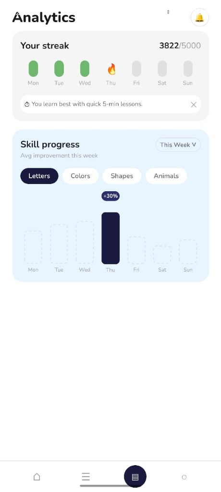
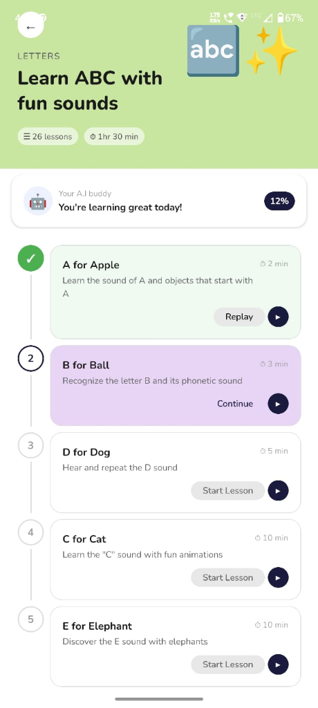

# SmartLearn — React Native Assignment

A kids learning app built with Expo + TypeScript, pixel-matched to the provided Figma design.

## Screens Implemented

| Screen | Description |
|--------|-------------|
| Onboarding | Splash with animated slides, Sign up / Log in |
| Home | Greeting, AI buddy, Today's pick, horizontal course cards |
| Analytics | Streak tracker, bar chart with skill progress tabs |
| Lesson Detail | Step-by-step lesson list with completed/active/locked states |

## Tech Stack

- **Expo** (SDK 50, managed workflow)
- **TypeScript** — strict mode, no `any`
- **React Navigation** v6 — Native Stack
- **Nunito** — Google Font via `@expo-google-fonts/nunito`
- **StyleSheet.create** — zero inline styles
- **react-native-reanimated** — ready for micro-interactions

## Run Locally

```bash
# 1. Clone the repo
git clone https://github.com/shivam-shukla888/SmartLearn-React-Native-Assignment.git
cd SmartLearn-React-Native-Assignment


# 2. Install dependencies
npm install

# 3. Start Expo
npx expo start

# 4. Run on device
# Press 'i' for iOS simulator
# Press 'a' for Android emulator
# Or scan QR code with Expo Go app
```

**Requirements:** Node 18+, Expo CLI, iOS Simulator (Mac) or Android Studio

## Project Structure

```
src/
  components/
    ui/          ← Button, Tag (reusable atoms)
    common/      ← BottomNav, AiBuddyCard (shared molecules)
  screens/       ← OnboardingScreen, HomeScreen, AnalyticsScreen, LessonDetailScreen
  navigation/    ← AppNavigator (stack config)
  theme/         ← colors.ts, spacing.ts, typography.ts, index.ts
  types/         ← Global interfaces and navigation param types
```

## Design Decisions

- **Nunito** selected — rounded sans-serif matching the Figma design's playful, child-friendly tone
- **Theme system** — every color, spacing value, and font references `src/theme/index.ts`; zero magic numbers in components
- **No `any`** — all props typed with interfaces; `tsc --noEmit` passes clean
- **Emoji illustrations** — used as placeholder where Figma contains custom SVG illustrations; swap with `<Image>` or an SVG library as needed
- **Bottom nav** built as a custom component (not a tab navigator) to match Figma's exact rounded-icon style
- **Streak bar** — pure React Native View layout, no third-party chart lib for the streak section
- **Bar chart** — rendered with proportional `View` heights; replace with `victory-native` or `react-native-gifted-charts` for production

## Assumptions

1. Figma Dev Mode was not accessible (locked to viewer role), so colors/spacing were extracted visually from screenshots.
2. Illustrations in the Figma are custom — replaced with emoji placeholders; production build should use `react-native-svg` or image assets.
3. Auth flow is not implemented — Sign Up / Log In navigate directly to Home.

## Screenshots & Demo


| Analytics Screen | Lesson Detail Screen |
|:---:|:---:|
|  |  |
